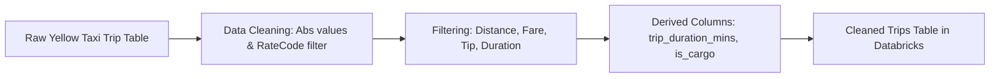

# 🚕 NYC Taxi Trip Data Pipeline

---

## Table of Contents
- [Overview](#overview)
- [Technologies Used](#technologies-used)
- [Features](#features)
- [Pipeline Usage](#pipeline-usage)
- [Pipeline Architecture](#pipeline-architecture)
- [Blog Post](#blog-post)

---

## Overview
This repository contains an **end-to-end PySpark data pipeline** for processing NYC Yellow Taxi trip data. The pipeline focuses on **data cleaning, validation, and transformation** to produce a high-quality dataset for analytics, machine learning, or reporting.

Key goals:
- Clean and sanitize numeric and categorical fields.
- Filter unrealistic or erroneous trips.
- Calculate derived fields such as trip duration and cargo indicator (if passengers == 0)
- Store the cleaned data in Databricks SQL Warehouse for downstream use.

---

## Technologies Used
- **PySpark**: Distributed data processing and transformations  
- **Databricks**: Cloud-based Spark platform  
- **SQL Warehouse**: Storage for cleaned tables  

---

## Features
- ✅ Cleans negative numeric values using absolute values for relevant fields.  
- ⚡ Filters out unrealistic trips based on thresholds (distance, fare, tip, etc.).  
- 📊 Calculates trip duration in minutes and removes trips longer than 3 hours.  
- 📦 Flags trips with zero distance as cargo (`is_cargo`).  
- 🛠️ Removes unknown RateCodeIDs (e.g., 99).  
- 💾 Writes cleaned tables back to Databricks for downstream analytics.

---

## Pipeline Usage
**Databricks**
- Load/ingest data into Databricks and change read pathway
- Run script through Databricks Workspace
- Outputs cleaned_trips

**Locally**
- Utilize PySpark Docker Container or run: *pip install pyspark*
- Load parquet data locally
- Change data path, i.e.: *df = spark.table("workspace.default.yellow_tripdata_2025_01")*
- Run in CLI: *spark-submit etlpipeline.py*

---

## Pipeline Architecture

---
## Blog Post
Blog post going over the project will be available soon.
